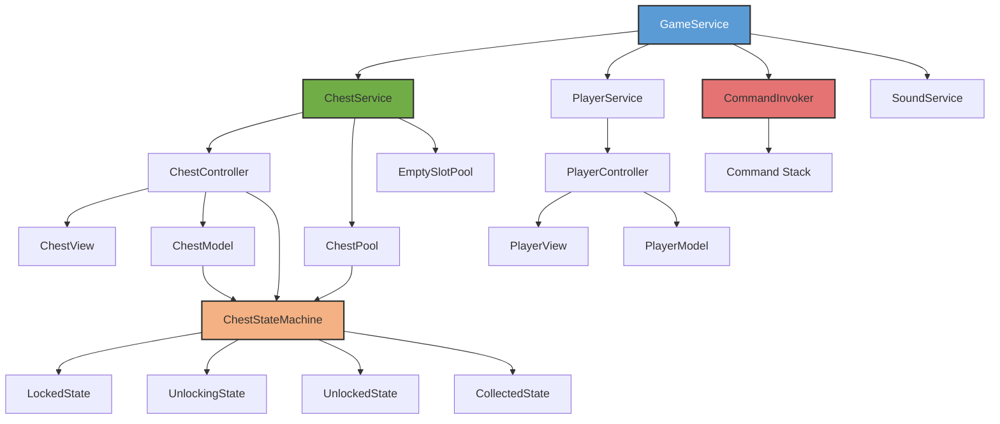

# Game System/Framework | Unity | C#

A chest unlock system with state-driven gameplay, command pattern for undo functionality, and event-based architecture. Features object pooling for performance optimization and service locator pattern for dependency management.

**Tech Stack:** Unity 3D | C# | State Pattern | Command Pattern | Observer Pattern | Object Pool Pattern

---

## Development Approach

I structured the system around MVC with a service layer managing cross-cutting concerns. GameService acts as a service locator, providing access to ChestService, PlayerService, SoundService, and CommandInvoker. Each chest maintains its own state machine, with ChestController coordinating between ChestView (UI) and ChestModel (data). When a player interacts with a chest, the state machine handles transitions while EventService broadcasts changes to registered listeners.

The challenge was managing multiple chests unlocking over real-time while maintaining only one active unlock timer. I solved this by having ChestService track `currentlyUnlockingChest` and rejecting new unlock attempts until the current chest completes. States handle their own logic - LockedState checks `CanStartUnlocking()` before transitioning, while UnlockingState runs a coroutine that decrements `RemainingUnlockTime` every second.



---

## Key Technical Systems

* ### State Machine with Dynamic Unlock Timing
    - Chests transition through four states using a state machine that implements `IState`. The critical challenge was handling real-time unlocking with instant unlock interruptions. UnlockingState runs a coroutine that updates `ChestModel.RemainingUnlockTime` every second, recalculating gem cost dynamically.
    - The gem cost formula uses `MINUTES_PER_GEM = 10f`, so a 1-hour chest costs 6 gems initially but drops to 3 gems after 30 minutes. I implemented `UpdateGemCost()` to recalculate on every timer tick, ensuring accurate pricing. The edge case was chests with < 10 minutes remaining - I added a minimum cost check to prevent 0-gem unlocks.
    - When a player instant-unlocks, `InstantChestUnlockCommand` executes, storing `previousState`, `previousUnlockTime`, and `previousPlayerGems` for undo functionality. The command pattern needed to restore the UnlockingState's coroutine, so I used `ChestStateMachine.ChangeState()` which calls `OnStateEnter()` - this restarts the timer coroutine with the restored `RemainingUnlockTime`.

* ### Command Pattern for Undoable Actions
    - The undo system needed to reverse gem spending and restore the unlocking timer. I implemented `ICommand` with `Execute()` and `Undo()` methods, storing all state before modifications. The tricky part was accessing private fields in ChestModel during undo.
    - I used reflection to set `remainingUnlockTime` and `chestSprite` directly:
 
```csharp
var timeField = typeof(ChestModel).GetField(
    "remainingUnlockTime",
    System.Reflection.BindingFlags.NonPublic |
    System.Reflection.BindingFlags.Instance
);

timeField.SetValue(model, previousUnlockTime);
```

    - This approach is fragile but necessary since ChestModel doesn't expose setters. For production, I'd add `RestoreState(float time, Sprite sprite)` to ChestModel to avoid reflection. CommandInvoker maintains a `Stack<ICommand>` and shows an undo notification after execution, hooking into `NotificationPanel.OnNotificationClosed` event to trigger the undo.

### Object Pooling for Dynamic Chest Management

The system spawns/despawns chests frequently, so I built `GenericObjectPool<T>` using a `List<PooledItem<T>>` that tracks `isUsed` flags. When requesting a chest, `GetItem()` searches for an unused instance before calling `CreateItem()`.

The challenge was managing sibling indices when removing chests. `RemoveChestAndMaintainMinimumSlots()` needed to preserve visual order while ensuring at least 4 slots remain. I store the deleted chest's siblingIndex, then shift all subsequent elements down by calling `SetSiblingIndex(index - 1)`. If total slots drop below the minimum, I spawn an EmptySlotView at the deleted position.

ChestPool and EmptySlotPool both extend `GenericObjectPool<T>` but implement different `CreateItem()` methods - ChestPool instantiates ChestView prefabs, while EmptySlotPool creates EmptySlotView instances. When returning to pool, chests call `OnReturnToPool()` which triggers `Cleanup()` to unregister from `ChestService.currentlyUnlockingChest` if needed.

### Event-Driven Sound System

SoundService registers listeners for all game events in a single method. Each event type triggers a corresponding sound:

```csharp
EventService.Instance.OnChestSpawned.AddListener(
    chest => PlaySoundEffects(SoundType.CHEST_CLICK)
);
```

The problem was memory leaks - if SoundService didn't unregister listeners before destruction, event subscriptions persisted. I implemented `UnregisterSoundEventListeners()` called in `GameService.OnDestroy()`, removing all registered callbacks. The event system uses `EventController<T>` with generic `Action<T>` delegates, allowing type-safe event invocations.

### Notification System with Conditional UI

NotificationPanel handles two display modes: standard notifications and undo-enabled notifications. `ShowNotificationWithUndo()` activates an extra `undoButtonContainer` GameObject that's hidden in normal notifications.

The animation system uses a CanvasGroup for fade effects and `RectTransform.localScale` for popup scaling. I implemented coroutines that interpolate alpha and scale values using an AnimationCurve over `fadeInDuration`. The tricky part was handling notification interruptions - if a new notification appears while fading, I stop the current coroutine before starting a new one to prevent overlapping animations.

Static event `Action OnNotificationClosed` allows UnlockedState to defer chest collection until the player dismisses the reward notification. I subscribe in `ShowRewardsNotification()` and unsubscribe in `CollectChestAfterNotification()` to avoid duplicate callbacks.

### Service Locator for Dependency Management

GameService implements `GenericMonoSingleton<T>` and initializes all services in `Awake()`. This creates a global access point: `GameService.Instance.chestService`. The advantage is loose coupling - LockedState doesn't need constructor injection of ChestService, it simply calls `GameService.Instance`.

The downside is hidden dependencies and harder testing. For production, I'd use a DI framework like Zenject. The singleton pattern prevents multiple GameService instances by checking `if (instance == null)` in `Awake()` and destroying duplicates.

---

## Technical Challenges

- **Dynamic Slot Management:** Maintaining visual order when removing chests required tracking sibling indices and shifting all subsequent UI elements. I had to handle the edge case where removing a chest would leave fewer than the minimum slots, conditionally spawning EmptySlotViews to maintain the required slot count.

- **Coroutine Lifecycle Management:** UnlockingState's timer coroutine needed to stop cleanly when instant-unlocking. I stored the Coroutine reference and called `StopCoroutine()` in `OnStateExit()`, preventing multiple timers from running simultaneously.

- **Reflection for State Restoration:** Undo functionality required modifying private ChestModel fields. Using reflection was necessary but adds fragility - if field names change, the code breaks at runtime. I added null checks on FieldInfo to prevent crashes if fields are renamed.

---

## What I Learned

The State pattern simplified chest behavior by isolating state-specific logic - adding new states like "Repairing" would just require implementing `IState`. Command pattern's reversibility made undo trivial but required careful state capture before execution. Object pooling significantly reduced GC pressure, but managing pooled object lifecycle (cleanup, reinitialization) added complexity. Using a service locator created global coupling, making unit testing harder - dependency injection would improve testability but adds initialization complexity for small projects.

---

## Play Link
https://sayannandi.itch.io/chest-system

[](https://youtu.be/ZzMUREyAbMA)
### [Gameplay Video](https://youtu.be/ZzMUREyAbMA)


